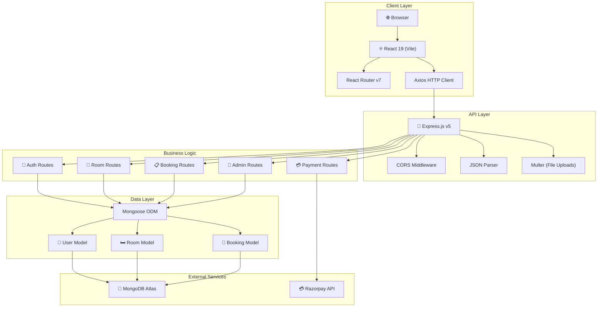
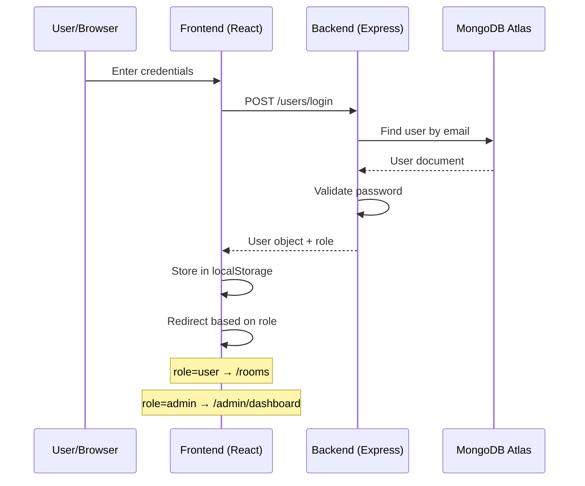
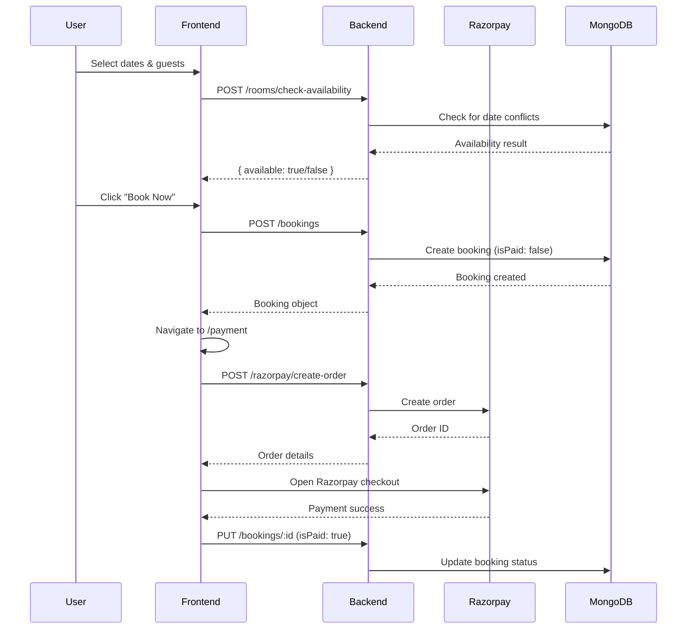
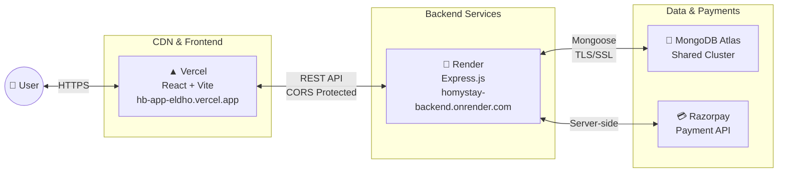

# 🏗️ Architecture Documentation — HOMYSTAY

## Overview

HOMYSTAY is built on the **MERN** stack (MongoDB, Express.js, React, Node.js) following a client-server architecture where the frontend and backend are independently deployed and communicate over REST APIs.

---

## System Architecture

---

## Database Schema

### User Collection
| Field | Type | Description |
|-------|------|-------------|
| `name` | String | Full name |
| `age` | Number | User age |
| `country` | String | Country |
| `phoneNumber` | String | 10-digit phone |
| `email` | String | Unique, required |
| `password` | String | Hashed password |
| `role` | String | `user` (default) |

### Room Collection
| Field | Type | Description |
|-------|------|-------------|
| `name` | String | Room/hotel name |
| `city` | String | City location |
| `address` | String | Full address |
| `price` | Number | Price per night (₹) |
| `roomType` | String | Bed type category |
| `maxCount` | Number | Max occupancy |
| `amenities` | [String] | WiFi, Pool, etc. |
| `images` | [String] | Image URLs |
| `phoneNumber` | String | Contact number |
| `rating` | Number | Average rating |
| `reviewsCount` | Number | Review count |

### Booking Collection
| Field | Type | Description |
|-------|------|-------------|
| `userId` | ObjectId | Reference to User |
| `hotel` | Object | `{ name, address }` |
| `room` | Object | Room details snapshot |
| `checkInDate` | Date | Check-in date |
| `checkOutDate` | Date | Check-out date |
| `guests` | Number | Number of guests |
| `totalPrice` | Number | Calculated total |
| `isPaid` | Boolean | Payment status |
| `status` | String | Booking status |
| `name` | String | Guest name |
| `email` | String | Guest email |

---

## Authentication Flow

---

## Booking & Payment Flow

---

## Deployment Architecture

